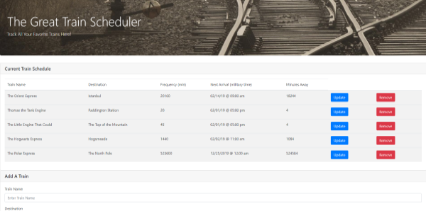

# Train-Scheduler
A train schedule application incorporating Firebase to host data and utilizing Moment.js to manipulate this data in order to provide up-to-date information about each train's arrival time and minutes until arrival at the station.

## Developed by: Sarah Kinneer
## January, 2019

## Technologies Used:
JavaScript, jQuery, Bootstrap, Moment.js, Firebase

## Photograph Source:
Many thanks to Pixabay on Pexels for beautiful, free stock images!

